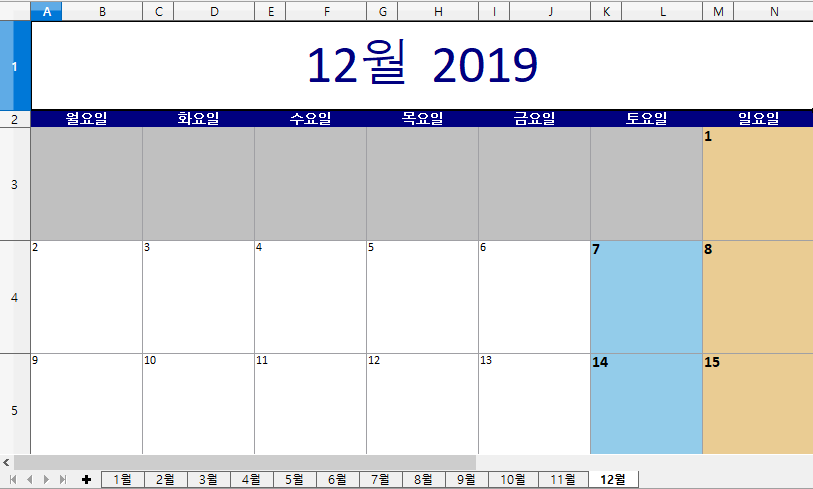

# QXlsx Examples

## [HelloWorld](HelloWorld)

- Hello world example

```cpp
// main.cpp

#include <QtGlobal>
#include <QCoreApplication>
#include <QtCore>
#include <QVariant>
#include <QDebug>

#include <iostream>
using namespace std;

// [0] include QXlsx headers 
#include "xlsxdocument.h"
#include "xlsxchartsheet.h"
#include "xlsxcellrange.h"
#include "xlsxchart.h"
#include "xlsxrichstring.h"
#include "xlsxworkbook.h"
using namespace QXlsx;

int main(int argc, char *argv[])
{
    QCoreApplication app(argc, argv);

    int row = 1; int col = 1;
	
    // [1]  Writing excel file(*.xlsx)
    QXlsx::Document xlsxW;
	QVariant writeValue = QString("Hello Qt!");
    xlsxW.write(row, col, writeValue); // write "Hello Qt!" to cell(A,1).
    xlsxW.saveAs("Test.xlsx"); // save the document as 'Test.xlsx'

    // [2] Reading excel file(*.xlsx)
    Document xlsxR("Test.xlsx"); 
    if (xlsxR.load()) // load excel file
    { 
        Cell* cell = xlsxR.cellAt(row, col); // get cell pointer.
        if ( cell != NULL )
        {
            QVariant var = cell->readValue(); // read cell value (number(double), QDateTime, QString ...)
            qDebug() << var; // display value. it is 'Hello Qt!'.
        }
    }

    return 0;
}
```

## [Demo](Demo)

Demonstrates basic operations in worksheets:

- how to format cells:
    - text alignment
    - cell borders
    - cell fills
    - text fonts
    - cell number formats
- how to merge, group and select cells in a worksheet
- how to write formulas
    - basic functions
    - array formulas
    - shared formulas

## [Types](Types)

Demonstrates various numeric types that can be written and read.

This example shows that `Document::read()` method returns values with respect to their type, whereas Cell::value() returns data as it is stored in cells (for numeric data it is usually `double`). Compare:

```cpp 
Document doc;
doc.write( "A3", QVariant(QDate(2019, 10, 9)) );
qDebug() << doc.read(3, 1).type() << doc.read(3, 1); // QVariant::QDate QVariant(QDate, QDate("2019-10-09"))
qDebug() << doc.cellAt(3, 1)->value().type() << doc.cellAt(3, 1)->value(); // QVariant::double QVariant(double, 43747)
```


## [DefinedNames](DefinedNames)

Demonstrates how to add defined names to the workbook and use them in formulas.

Defined names are descriptive names to represent cells, ranges of cells, formulas, or constant values. Defined names can be used to represent a range on any worksheet.

Excerpt from [definedNames.cpp](DefinedNames/definedNames.cpp)

```cpp
...
Document xlsx;
xlsx.addDefinedName("MyCol_1", "=Sheet1!$A$1:$A$10");
xlsx.write(11, 1, "=SUM(MyCol_1)");
...
```

## [Calendar](Calendar)

Demonstrates how to create a workbook with the current year calendar.



## [Charts](Charts)

Demonstrates adding various charts to a worksheet.

- [chart.cpp](Charts/chart.cpp) demonstrates how to add charts of different types.
- [chertextended.cpp](Charts/chartextended.cpp) demonstrates how to change title and gridlines of a chart.
- [barchart.cpp](Charts/barchart.cpp) demonstrates various bar chart styles.
- [chartlinefill.cpp](Charts/chartlinefill.cpp) demonstrates how to change lines and fills in charts.

## [CombinedChart](CombinedChart)

Demonstrates how to add bar series and line series on the same chart. Demonstrates how to move one of the series to the right axis.


## [Chartsheets](Chartsheets)

Demonstrates how to add and copy chartsheets, how to use picture fills.

## [Sheets](Sheets)

Demonstrates how to set up sheet parameters such as page properties, print properties, view properties etc.

## [Chromatogram](Chromatogram)

Demonstrates a simple GUI application that uses QXlsx to generate a report based on a file data.

## [TestExcel](TestExcel)

- :zap: Basic examples (based on QtXlsx examples)
    - [data validation](TestExcel/datavalidation.cpp)
    - [document property](TestExcel/documentproperty.cpp)
    - [extract data](TestExcel/extractdata.cpp)
    - [hyperlink](TestExcel/hyperlinks.cpp)
    - [image](TestExcel/image.cpp)
    - [read style](TestExcel/readStyle.cpp)
    - [richtext](TestExcel/richtext.cpp)
    - [row column](TestExcel/rowcolumn.cpp)
    - [style](TestExcel/style.cpp)
    - [worksheet operations](TestExcel/worksheetoperations.cpp)


## [ExcelReading](ExcelReading)

Loads xlsx file that was created in Excel and writes it back.

The file chartsheet1.xlsx contains complex shape and line formatting, data labels, data table, Excel extension data etc.

## [HelloAndroid](HelloAndroid)

- See 'HelloAndroid' example using QML and native C++.

- Qt 5.11.1 / gcc 4.9 / QtCreator 4.6.2 
- Android x86 (using Emulator <Android Oreo / API 26>)
- Android Studio 3.1.3 (Android NDK 17.1)


## [WebServer](WebServer)
- Loads xlsx file and displays on Web.
	- Connect to `http://127.0.0.1:3001` 
- C++ 14(17) is required. Old compilers are not supported.


## [ShowConsole](ShowConsole)
- Loads xlsx file and displays in console.
  - [Usage] ShowConsole *.xlsx
- C++ 11 is required. Old compilers is not supported.


## [ReadColor](ReadColor) 
- Read cell color


## XlsxFactory 
- Load xlsx file and display on Qt widgets. 
- Moved to personal repository for advanced app.
	- https://j2doll.tistory.com/654
	- The source code of this program cannot be released because it contains a commercial license.


